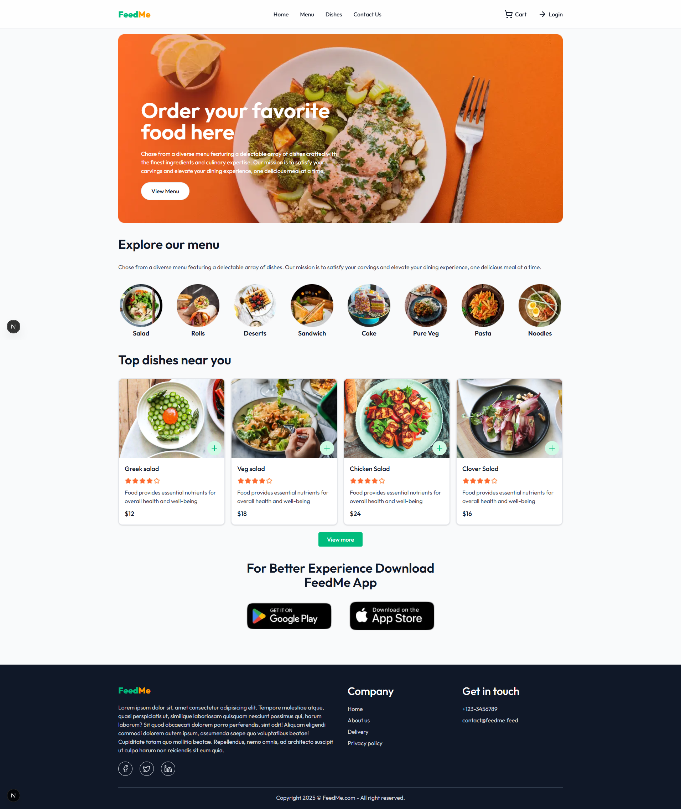

# Feed Me 🍔 - Food Delivery Web App

A full-stack food delivery web application built with **Next.js** and **MongoDB**. It allows users to browse food items, add them to a cart, and (optionally) place orders. Built for performance, scalability, and modern UI design.

---

## 🚀 Features

-   ⚛️ Built with **Next.js (App Router)**
-   🎨 Styled with **Tailwind CSS**
-   🛒 Add-to-cart functionality
-   🔐 Authentication
-   🌐 API Routes using Next.js
-   🗃️ MongoDB integration via Mongoose
-   📱 Fully responsive design

---

## 🖼️ Demo

🔗 [Live Demo](https://feed-me-food-delivery-website-by-hussain.vercel.app/)



---

## 📁 Project Structure

```
feed-me-food-delivery-website/
├── src/                         # Source code
│   ├── app/                     # Next.js App Router
│   │   ├── (auth)/              # Authentication routes group
│   │   │   ├── login/
│   │   │   ├── profile/
│   │   │   └── register/
│   │   ├── api/                 # API routes
│   │   │   ├── auth/            # Authentication API endpoints
│   │   │   └── products/        # Products API endpoints
│   │   ├── cart/                # Cart page
│   │   ├── dishes/              # Dishes page
│   │   ├── order/               # Order page
│   │   ├── layout.js            # Root layout
│   │   ├── page.js              # Home page
│   │   └── globals.css          # Global styles
│   ├── components/              # React components
│   │   ├── dishes/              # Dishes related components
│   │   ├── home/                # Home page components
│   │   ├── navbar/              # Navigation components
│   │   └── skeletons/           # Loading skeleton components
│   ├── context/                 # Context providers for state management
│   │   ├── CartContext.jsx
│   │   └── NavbarContext.jsx
│   ├── actions/                 # Server actions and logic
│   │   ├── auth.js
│   │   └── shop.js
│   ├── mongodb/                 # MongoDB related files
│   │   ├── models/              # Database models
│   │   │   ├── product.js
│   │   │   └── user.js
│   │   └── connectDB.js         # Database connection
│   ├── hooks/                   # Custom React hooks
│   │   ├── useCookie.js
│   │   └── useDebounce.js
│   ├── lib/                     # Utility functions and libraries
│   │   ├── menu-list.js
│   │   └── utils.js
│   └── middleware.js            # Next.js middleware
├── public/                      # Static files
│   ├── images/                  # Image assets
│   │   ├── app_store.png
│   │   ├── banner.png
│   │   ├── homepage.png
│   │   ├── menu_*.png           # Menu category images
│   │   ├── play_store.png
│   │   └── rating_stars.png
│   └── *.svg                    # SVG icons
├── .env.local                   # Environment variables
├── .gitignore                   # Git ignore file
├── eslint.config.mjs            # ESLint configuration
├── jsconfig.json                # JavaScript configuration
├── next.config.mjs              # Next.js configuration
├── package.json                 # Package dependencies
├── postcss.config.mjs           # PostCSS configuration
└── README.md                    # Project documentation
```

---

## 🛠️ Tech Stack

-   **Next.js (JavaScript)**
-   **MongoDB & Mongoose**
-   **Tailwind CSS**
-   **Vercel (for deployment)**

---

## ⚙️ Getting Started

### 1. Clone the Repository

```bash
git clone https://github.com/hussain-ahmed2/feed-me-food-delivery-website.git
cd feed-me-food-delivery-website
```

### 2. Install dependencies

```bash
npm install
```

### 3. Setup environment variables

```bash
MONGODB_URI=mongodb+srv://<username>:<password>@cluster.mongodb.net/feedme
JWT_SECRET=<your_secret_key>
```

### 4. Run the app

```bash
npm run dev
```

---

## Contact

### 🌐 [Portfolio](https://hussainahmed.vercel.app)

### 📧 [Mail](mailto:hussainahmed.vu@gmail.com)
